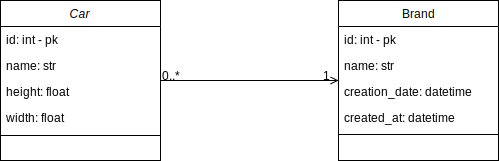

## Introduction
This is a small dockerized API service designed using Django, Django REST Framework and Sqlite database. Its purpouse is to manage car brands and their related car models.

## Structure
Like most Django projects this one has a project package called **cars/** and an app where the API has been implemented, in the package **main/**. Inside **main/** we have the **models** module for the data layer, the **serializers** module for *serializing* such data, the **views** module for handling the API resquests and finally the **api** module for declaring the API's endpoints.

## Creating the docker image
In order to install the docker image we must have the docker daemon running and run the following command `$ docker build -t cars .`

The we run the following command `$ docker-compose build`.

## Settin up Django
After having our docker image created the next thing is to migrate our Django models to the database. To do that we run `$ docker-compose run cars python manage.py migrate`. Then we create a superuser for Django: `$ docker-compose run cars python manage.py createsuperuser`.

## Running the app
With an already built docker image in which to run a container we justIn order to run the app we can run the following command `$ docker-compose up`. The local server will be hosted in http://0.0.0.0:8000.

## Data model


### Brand
- name: chardfield (unique)
- creation_date: datetime (optional)
- created_at: datetime (readonly)
- cars: Car[] (readonly)
### Car
- name: charfield
- height: decimal (two decimal digits)
- width: decimal (two decimal digits)
- brand: Brand

## API endpoints
We have two entities to interact

### Brands

#### GET
- GET /carbrands/. Example:
    - request: GET /api/carbrands/
    - response: **200 OK**
    ```
    [
        {
            "id": 7,
            "cars": [
                {
                    "id": 4,
                    "brand": "Brand1",
                    "name": "Car1",
                    "height": "10.00",
                    "width": "10.00"
                }
            ],
            "created_at": "2021-10-03T17:38:00.262791Z",
            "name": "Brand1",
            "creation_date": null
        }
    ]
    ```
- GET /carbrands/:id. Example:
    - request: GET /api/carbrands/7
    - response: **200 OK**
    ```
    {
        "id": 7,
        "cars": [
            {
                "id": 4,
                "brand": "Brand1",
                "name": "Car1",
                "height": "10.00",
                "width": "10.00"
            }
        ],
        "created_at": "2021-10-03T17:38:00.262791Z",
        "name": "Brand1",
        "creation_date": null
    } 
    ```
    - error:
        - When using and id that does not exist in the database:
            - request: GET /api/carbrands/0
            - response: **404 NOT FOUND**
            ```
            {
                "detail": "Not found."
            }
            ```
#### POST
- POST /carbrands/. Example:
    - request: POST /api/carbrands/
    ```
    {
        "name": "Brand2",
        "creation_date": "2021-10-03T17:38:00" // Date in YYYY-MM-DDTHH:mm:ss format. Where T is a separator between date and time.
    }
    ```
    - response: **201 CREATED**
    ```
    {
        "id": 8,
        "cars": [],
        "created_at": "2021-10-03T18:12:42.863991Z",
        "name": "Brand2",
        "creation_date": "2021-10-03T17:38:00Z"
    } 
    ```
    - error:
        - When the name attribute is empty:
            - request: POST /api/carbrands/
            ```
            {
                "name": "",
                "creation_date": "2021-10-03T17:38:00" // Date in YYYY-MM-DDTHH:mm:ss format. Where T is a separator between date and time.
            }
            ```
            - response: **400 BAD REQUEST**
            ```
            {
                "name": [
                    "This field may not be blank."
                ]
            }
            ```

#### PUT
- PUT /carbrands/:id/. Example:
    - request: PUT /api/carbrands/7
    ```
    {
        "name": "Brand2",
        "creation_date": "2021-10-03T17:38:00" // Date in YYYY-MM-DDTHH:mm:ss format. Where T is a separator between date and time.
    }
    ```
    - response: **200 OK**
    ```
    {
        "id": 7,
        "cars": [
            {
                "id": 4,
                "brand": "Brand1",
                "name": "Car1",
                "height": "10.00",
                "width": "10.00"
            }
        ],
        "created_at": "2021-10-03T17:38:00.262791Z",
        "name": "Brand1",
        "creation_date": null
    } 
    ```
    - error:
        - When the id does not exist in the database:
            - request: PUT /api/carbrands/0
            - response: **404 NOT FOUND**
            ```
            {
                "detail": "Not found."
            }
            ```
        - When the name attribute is empty:
            - request: PUT /api/carbrands/7
            ```
            {
                "name": "",
                "creation_date": "2021-10-03T17:38:00" // Date in YYYY-MM-DDTHH:mm:ss format. Where T is a separator between date and time.
            }
            ```
            - response: **400 BAD REQUEST**
            ```
            {
                "name": [
                    "This field may not be blank."
                ]
            }
            ```
#### DELETE
- DELETE /carbrands/:id/. Example:
    - request: DELETE /api/carbrands/7
    - response: **204 NO CONTENT**
    - error:
        - When the id does not exist in the database:
            - request: DELETE /api/carbrands/0
            - response: **404 NOT FOUND**
            ```
            {
                "detail": "Not found."
            }
            ```
        - When the brand has related cars in the database:
            - request: DELETE /api/carbrands/7
            - response: **403 FORBIDDEN**
            ```
            {
                "message": "A brand that has related car models cannot be deleted",
                "status": 500
            }
            ```
### Car models

#### GET
- GET /carmodels/. Example:
    - request: GET /api/carmodels/
    - response: **200 OK**
    ```
    [
        {
            "id": 4,
            "brand": "Brand2",
            "name": "Car1",
            "height": "10.00",
            "width": "10.00"
        }
    ]
    ```
- GET /carmodels/:id. Example:
    - request: GET /api/carmodels/7
    - response: **200 OK**
    ```
    {
        "id": 4,
        "brand": "Brand2",
        "name": "Car1",
        "height": "10.00",
        "width": "10.00"
    }
    ```
    - error:
        - When using and id that does not exist in the database:
            - request: GET /api/carmodels/0
            - response: **404 NOT FOUND**
            ```
            {
                "detail": "Not found."
            }
            ```
#### POST
- POST /carmodels/. Example:
    - request: POST /api/carmodels/
    ```
    {
        "brand": "Brand2",
        "name": "Car1",
        "height": "10.00", // Decimal field with two decimal places
        "width": "10.00" // Decimal field with two decimal places
    }
    ```
    - response: **201 CREATED**
    ```
    {
        "id": 5,
        "brand": "Brand2",
        "name": "Car2",
        "height": "10.00",
        "width": "10.00"
    }
    ```
    - error:
        - When the any attribute is empty:
            - request: POST /api/carmodels/
            ```
            {
                "brand": "Brand2",
                "name": "Car2",
                "height": "",
                "width": "10.00"
            }
            ```
            - response: **400 BAD REQUEST**
            ```
            {
                "height": [
                    "A valid number is required."
                ]
            }
            ```

#### PUT
- PUT /carmodels/:id/. Example:
    - request: PUT /api/carmodels/5
    ```
    {
        "brand": "Brand2",
        "name": "Car3",
        "height": "15.00", // Decimal field with two decimal places
        "width": "10.00" // Decimal field with two decimal places
    }
    ```
    - response: **200 OK**
    ```
    {
        "id": 5,
        "brand": "Brand2",
        "name": "Car3",
        "height": "15.00",
        "width": "10.00"
    }
    ```
    - error:
        - When the id does not exist in the database:
            - request: PUT /api/carmodels/0
            - response: **404 NOT FOUND**
            ```
            {
                "detail": "Not found."
            }
            ```
        - When any attribute is empty:
            - request: PUT /api/carmodels/5
            ```
            {
                "id": 5,
                "brand": "",
                "name": "Car3",
                "height": "15.00", // Decimal field with two decimal places
                "width": "10.00" // Decimal field with two decimal places
            }
            ```
            - response: **400 BAD REQUEST**
            ```
            {
                "name": [
                    "This field may not be blank."
                ]
            }
            ```
#### DELETE
- DELETE /carmodels/:id/. Example:
    - request: DELETE /api/carmodels/5
    - response: **204 NO CONTENT**
    - error:
        - When the id does not exist in the database:
            - request: DELETE /api/carmodels/0
            - response: **404 NOT FOUND**
            ```
            {
                "detail": "Not found."
            }
            ```
